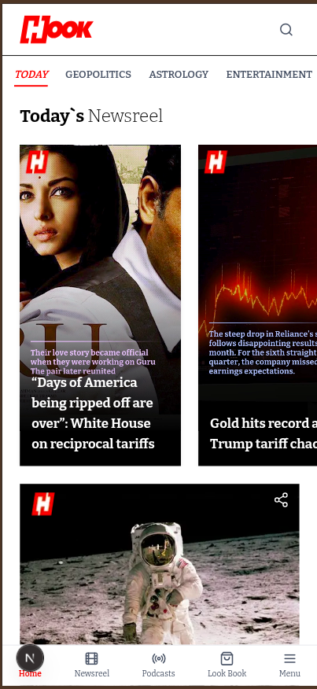
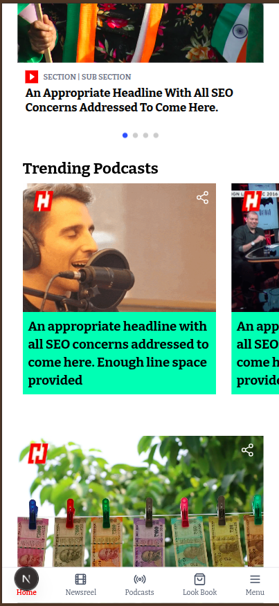

# 📱 ICD India - Mobile-Only Web App (Next.js + TypeScript + Tailwind CSS)

This project is a **mobile-only responsive web application** built using **Next.js**, **TypeScript**, and **Tailwind CSS**. It was developed as part of assignment given by ICD India and is optimized for small screen devices.

## 🚀 Tech Stack

- ✅ [Next.js](https://nextjs.org/)
- ✅ [TypeScript](https://www.typescriptlang.org/)
- ✅ [Tailwind CSS](https://tailwindcss.com/)
- ✅ Mobile-first responsive design

---

## 📲 Live Demo

🔗 [Live URL](https://icd-sigma.vercel.app/)  

---

## 📸 Screenshots





> All views are optimized for mobile devices only.

---

## 🛠️ Getting Started

### 1️⃣ Clone the repository

```bash
git clone https://github.com/vikaschouhan97/icd
cd icd
```

### 2️⃣ Install dependencies

```bash
npm install
```

### 3️⃣ Run the development server

```bash
npm run dev
```

### 🔧 Build for production

```bash
npm run build
npm start
```

## 👨‍💻 Author

- [Vikas Chouhan](https://www.linkedin.com/in/vikas-chouhan-646403121/)
- Email: vikaschouhan360@gmail.com

---

## ✅ Notes

- ⚠️ This project is **mobile-first** and may not display properly on desktop.
- Developed solely for evaluation as part of a job assignment.

---

## 📃 License

This project is for demonstration purposes only and is not licensed for production use.
